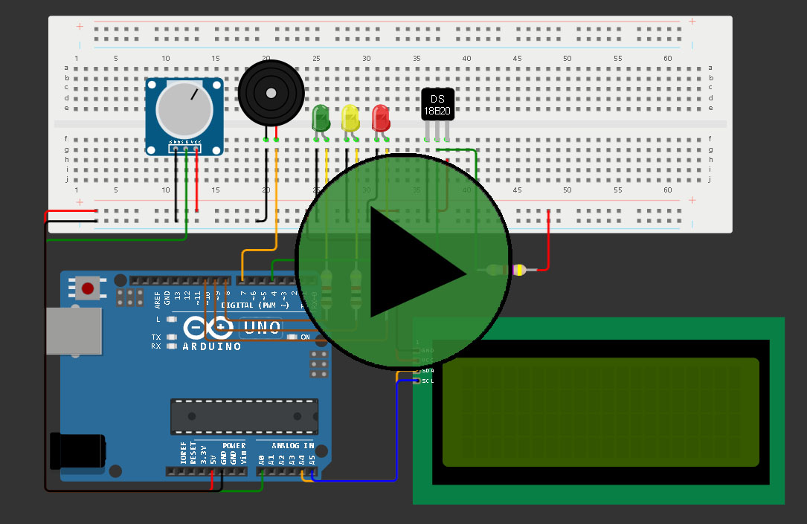

# Projeto Blue Reckon 
## Índice

1. [Sobre](#sobre)
   - [Nosso Projeto](#nosso-projeto)
   - [Nossa Proposta](#nosso-projeto)
   - [Nosso Objetivo](#nosso-objetivo)
2. [Simulação Wokwi](#simulação-wokwi)
3. [Técnologias](#técnologias)
   - [Importante](#importante)
4. [Disclaimer](#disclaimer)
5. [Explicação do Código](#explicação-do-código)
   - [Install](#install)
   - [Imports](#imports)
6. [Funções](#funções)
   - [force_num](#force_num)
   - [force_yes_no](#force_yes_no)
   - [media_template](#media_template)
   - [verifica_leitura](#verifica_leitura)
   - [exibe_leituras](#exibe_leituras)
   - [read_serial](#read_serial)
   - [simula_payload](#simula_payload)
   - [verifica_arduino](#verifica_arduino)
7. [Execução](#execução)
   - [Declarações Globais](#declarações-globais)
   - [Verificação Arduino](#verificação-arduino)
8. [Principal](#principal)
8. [Colaboradores do Projeto](#colaboradores-do-projeto)

## Sobre
<a href="" target="_blank" style="text-decoration: none"></a>


### Nosso Projeto
Monitoramento de Temperatura e PH com Arduino foi construído utilizando um sensor DS18B20 e um sensor de PH. Os dados são processados e armazenados em arrays, transmitidos em formato JSON via comunicação serial para um aplicativo Python. LEDs e buzzer são usados para indicar o estado das leituras.

### Nossa Proposta
Pretendemos com essa plataforma, informar sobre os riscos de não cuidar do nosso bem precioso, o oceano, monitorá-lo e sugerir soluções, como o armazenamento de dados históricos para identificar padrões e prever futuras condições, ajudando a prevenir superaquecimento e danos, pois transformam dados brutos em informações acionáveis, melhorando a tomadas de decisões.

### Nosso Objetivo
Queremos mudar o mindset das novas gerações, para que estas possam mudar o mundo: esse é o propósito do nosso projeto que tem como missão informar e alertar sobre os perigos de negligenciar o Oceano. Cuidar deste é o nosso dever como ser humano. O nosso projeto consiste em uma plataforma de informações com artigos, informações e um dashboard de monitoramento, no qual será demonstrado medições feitas através de sensores, informando em tempo real dados sobre o Ph da água e  a temperatura. 

## Simulação Wokwi
[Projeto Edge](https://github.com/MateusLem/gs-edge)

<a href="https://wokwi.com/projects/399438925654312961" target="_blank" style="text-decoration: none"></a>

## Técnologias
<a href="https://www.python.org/downloads/" target="_blank" style="margin-right:10px"></a>

### **_IMPORTANTE_**
Este código exige o uso de Python 3.10+

## Disclaimer
Devido à natureza do simulador Wokwi, não foi possível conectar o Script ao monitor Serial.

Pensando nisso, incluímos adaptações ao código para permitir que usuários com a mesma limitação possam desfrutar da solução, dando ao usuário a opção de continuar com a execução mesmo sem o Arduino.

Além disso, como o Arduino não inicia caso o código esteja previamente rodando, incluimos uma condição que impede a execução do código caso o usuário decida conectar o Arduino de última hora. 


## Explicação do Código
### Install
Extensão Python Serial Port para Win32, OSX, Linux, BSD, Jython, IronPython ([DOCS](https://pypi.org/project/pyserial/))
```
pip install pyserial
```

### Imports
serial -> Pyserial ([DOCS](https://pypi.org/project/pyserial/))

json -> Nativa Python ([DOCS](https://docs.python.org/pt-br/3/library/json.html))

random -> Nativa Python ([DOCS](https://docs.python.org/pt-br/3/library/random.html))
```
import serial
import json
import random
```

## Funções
### force_num
Esta função força com que o usuário informe um número inteiro, positivo/nulo. É utilizada para padronizar as respostas dos usuários.

Inicialmente, pede-se um input para o usuário, com um texto de template fornecido como parâmetro. Em seguida, um loop `while` é iniciado caso a resposta não seja um numeral (o que inclui '.', ',' e '-').

Enquanto essa condição não é cumprida, uma mensagem de erro é exibida, seguida de um novo input.

Ao final da execução, o valor escrito é retornado como um `int`.
```
def force_num(msg: str) -> int:
    """Força que o input do usuário seja um numeral"""
    resp = input(msg)
    while not resp.isnumeric():
        print("Resposta inválida")
        resp = input(msg)
    return int(resp)
```
### force_yes_no
Esta função força com que o usuário escolha entre 'sim' ou 'não'.

Primeiramente, a função exibe uma mensagem recebida como parâmetro. Em seguida, a variável `resp` é criada, recebendo como valor o retorno da função [force_num](#force_num), obrigando a resposta ser um numeral.

De forma similar à função [force_num](#force_num), um loop `while` é iniciado caso o valor da variável seja diferente de '1' e '2', exibindo uma mensagem de erro e forçando o usuário à informar um novo valor.

Por fim, a resposta final é retornada como um `int`.
```
def force_yes_no(msg: str) -> int:
    """Força que o input do usuário seja 1 -> Sim ou 2 -> Não"""
    print(msg)
    resp = force_num("1 -> Sim | 2 -> Não: ")
    while not (resp == 1 or resp == 2):
        print("Resposta inválida")
        resp = force_num("1 -> Sim | 2 -> Não: ")
    return resp
```
### media_template
Esta função permite calcular a média dos valores de uma dada lista (recebida como parâmetro).

Primeiramente, é criada a variável local _total_ que irá receber a soma dos elementos da lista.
Em seguida, um loop _for_ itera por cada elemento, torna-os float para previnir erros de tipo e soma-os à variável.

Terminado o loop, a variável media é criada para armazenar a média, dada pela divisão de total pelo comprimento da lista, adquirido através da função `len()`.

Finalmente, o valor da média é formatado para ter duas casas decimais e convertido para `float` antes de ser retornado.
```
def media_template(lista: list) -> float:
    """
    Permite calcular médias de listas de forma genérica.
    Retorna o resultado como float com 2 casas decimais
    """
    total = 0
    for elemento in lista:
        total += float(elemento)
    media = total / len(lista)
    media_2f = float("{:.2f}".format(media))
    
    return media_2f
```
### verifica_leitura
Esta função verifica os campos de "média" da leitura e exibe uma mensagem condizente com os dados lidos. A função recebe um dicionário `payload` como parâmetro, que deve conter as chaves `'mediaTemp'` e `'mediapH'`.

Primeiramente, as médias de temperatura e pH são extraídas do dicionário. Em seguida, a variável text é criada para armazenar as mensagens que serão exibidas.

Dependendo dos valores de média de temperatura e pH, são adicionadas mensagens apropriadas à variável text.

Se a temperatura estiver abaixo de 18°C ou acima de 28°C, são geradas mensagens indicando que a temperatura está fora do normal. Caso contrário, uma mensagem indicando que a temperatura está dentro do parâmetro esperado é gerada.

Da mesma forma, se o pH estiver abaixo de 7.4 ou acima de 8.5, são geradas mensagens indicando que o pH está fora do normal, caso contrário, uma mensagem indicando que o pH está dentro do parâmetro esperado é gerada.

Por fim, o texto é exibido formatado para melhor leitura do usuári
```
def verifica_leitura(payload: dict) -> None:
    """Verifica os campos de "média" da leitura e exibe uma mensagem condizente com os dados lidos"""
    media_temp = payload["mediaTemp"]
    media_ph = payload["mediapH"]
    text = ""

    if media_temp < 18:
        text += f"A temperatura está abaixo do normal - {media_temp}°C\n"
    elif media_temp > 28:
        text += f"A temperatura está abaixo do normal - {media_temp}°C\n"
    else:
        text += f"A temperatura está dentro do parâmetro esperado - {media_temp}°C\n"

    if media_ph < 7.4:
        text += f"O pH está abaixo do normal - {media_ph} - teor ácido"
    elif media_ph > 8.5:
        text += f"O pH está acima do normal - {media_ph} - teor alcalino"
    else:
        text += f"O pH está dentro do parâmetro esperado - {media_ph}"

    # Exibição do texto com formatação para melhor leitura do usuário
    print("\n"+"=" * 60)
    print(text)
    print("=" * 60 + "\n")
```
### exibe_leituras
Esta função lê o payload enviado pelo Arduino e formata-o para ser lido, pensando na melhor experiência do usuário. A função recebe um dicionário `payload` como parâmetro.

Para cada campo no dicionário, um bloco de texto é exibido. Se o campo contiver a palavra 'media', o valor correspondente é exibido diretamente. Caso contrário, é assumido que o campo contém uma lista de leituras.

Para cada leitura na lista, é exibida uma linha indicando a posição da leitura e o valor correspondente.
```
def exibe_leituras(payload: dict) -> None:
    """Lê o payload enviado pelo Arduino e formata-o para ser lido, pensando na melhor experiência do usuário"""
    print("\n")
    for campo in payload:
        print("=" * 25)
        # Separa as exibições de média das demais, uma vez que são apenas um valor, e não uma lista de dados
        if "media" in campo:
            print(f"{campo}: {payload[campo]}")
        else:
            print(f"Dados: {campo}")
            for leitura in range(len(payload[campo])):
                print(f"{leitura+1}° leitura: {payload[campo][leitura]}")
    print("=" * 25 + "\n") 
```
### read_serial
Esta função lê o monitor Serial do Arduino e converte o JSON impresso como um dicionário. Ela não recebe parâmetros.

Primeiramente, a conexão serial é estabelecida com a porta e a taxa de baud especificadas pelas variáveis globais `serial_port` e `baud_rate`.

A função entra em um loop que verifica se há dados disponíveis na conexão serial. Quando dados são encontrados, eles são lidos e decodificados como uma string UTF-8. A string é limpa de espaços em branco e, se não estiver vazia, a conexão serial é fechada e os dados são convertidos de JSON para um dicionário, que é então retornado.
```
def read_serial() -> dict:
    """Lê o monitor Serial do Arduino, e converte o json impresso como dicionário"""
    ser = serial.Serial(serial_port, baud_rate)
    while True:
        if ser.in_waiting > 0:
            json_data = ser.readline().decode("utf-8").strip()
            if json_data:
                ser.close()
                return json.loads(json_data)
```
### simula_payload
Esta função simula uma leitura de payload do Arduino enviada pelo monitor Serial. Ela não recebe parâmetros.

Primeiramente, listas de leituras de temperatura e pH são geradas. Cada lista contém 10 valores flutuantes aleatórios, formatados para ter duas casas decimais.

Em seguida, são calculadas as médias das leituras de temperatura e pH usando a função [media_template](#media_template).

Finalmente, é retornado um dicionário contendo as leituras de temperatura, pH, e suas respectivas médias.
```
def simula_payload() -> dict:
    """Simula uma leitura de payload do Arduino enviada pelo monitor Serial"""
    # Leituras de temperatura e pH
    temperaturas = [float("{:.2f}".format(random.uniform(2, 30))) for _ in range(10)]
    ph = [float("{:.2f}".format(random.uniform(0, 14))) for _ in range(10)]

    # Calculo das médias
    media_temp = media_template(temperaturas)
    media_ph = media_template(ph)

    # Json do protótipo
    return {
        "temperaturas": temperaturas,
        "pH": ph,
        "mediaTemp": media_temp,
        "mediapH": media_ph,
    }
```
### verifica_arduino
Esta função verifica se o Arduino está conectado. Ela não recebe parâmetros e retorna um dicionário contendo os dados lidos do Arduino ou simulados.

Se a variável global `arduino` for `True`, a função [read_serial](#read_serial) é chamada para ler os dados do Arduino. Caso contrário, a função [simula_payload](#simula_payload) é chamada para simular os dados.

Esta função foi criada principalmente para reutilização de código.
```
def verifica_arduino() -> dict:
    """Verifica se o Arduino está conectado"""
    if arduino:
        return read_serial()
    return simula_payload()
```

## Execução
### Declarações globais
As seguintes variáveis globais são definidas para configurar a conexão com o Arduino e a execução do programa:
```
# Configurações do Arduino - ALTERAR CONFORME SUA NECESSIDADE
serial_port = "COM1"
baud_rate = 9600

# Configuração de execução
arduino = True  # Pressupõe que o usuário está com o Arduino conectado
run = True  # Força execução do programa
```

### Verificação Arduino
O trecho de código a seguir pergunta ao usuário se o Arduino está conectado. Se o usuário responder que não, ele pergunta se deseja conectá-lo.

Se o usuário optar por conectar o Arduino, o programa informa que deve ser encerrado, pois o Arduino precisa estar previamente conectado para funcionar. Caso contrário, o programa continua com a variável `arduino` definida como `False`.
```
conn = force_yes_no("O Arduino está conectado?")
if conn == 2:
    arduino = False
    conn = force_yes_no("\nVocê deseja conecta-lo?\nLembrando que uma vez iniciado, não será possível conecta-lo mais.")  # Em caso negativo, pressupõe-se que o usuário quer apenas simular o funcionamento do Arduino
    if conn == 1:
        print("\nBeleza!!!")
        print("Como o Arduino precisa estar previamente conectado para funcionar, vamos encerrar o programa por aqui!\n")
        run = False
```
Com essas funções e a estrutura global configurada, o programa pode ser executado para ler dados do Arduino ou simular leituras, exibir os dados e verificar se estão dentro dos parâmetros esperados.

## Principal
### Execução Completa
Este trecho de código configura e executa o programa principal. Ele inicializa as configurações do Arduino e define as variáveis globais necessárias para a execução do programa.

Primeiramente, são configuradas as variáveis para a porta serial e a taxa de transmissão do Arduino. Também são definidas variáveis para indicar se o Arduino está conectado e se o programa deve ser executado.

Se a execução do programa for permitida (variável run for True), uma leitura inicial do Arduino (ou simulação) é realizada e a mensagem de boas-vindas é exibida.

Em seguida, um loop while é iniciado para exibir um menu de opções para o usuário. O usuário pode escolher entre gerar uma nova leitura, verificar o status do sistema, exibir a última leitura ou encerrar o programa.

Dependendo da opção selecionada pelo usuário, diferentes funções são chamadas:
- [verifica_arduino](#verifica_arduino): Gera uma nova leitura.
- [verifica_leitura](#verifica_leitura): Verifica e exibe o status da última leitura.
- [exibe_leituras](#exibe_leituras): Exibe os dados da última leitura.
- [force_yes_no](#force_yes_no): Confirma se o usuário deseja encerrar o programa.

Se o usuário confirmar que deseja encerrar o programa, a variável run é definida como False e o loop é encerrado.

Na conclusão, uma mensagem de agradecimento é exibida ao usuário.
```
# Configurações do Arduino - ALTERAR CONFORME SUA NECESSIDADE
serial_port = "COM1"
baud_rate = 9600

# Configuração de execução
arduino = True  # Pressupõe que o usuário está com o Arduino conectado
run = True  # Força execução do programa

conn = force_yes_no("O Arduino está conectado?")
if conn == 2:
    arduino = False
    conn = force_yes_no("\nVocê deseja conecta-lo?\nLembrando que uma vez iniciado, não será possível conecta-lo mais.")  # Em caso negativo, pressupõe-se que o usuário quer apenas simular o funcionamento do Arduino
    if conn == 1:
        print("\nBeleza!!!")
        print("Como o Arduino precisa estar previamente conectado para funcionar, vamos encerrar o programa por aqui!\n")
        run = False

if run:
    payload = verifica_arduino()
    print("\n"+"=" * 30)
    print("Bem vindo ao Blue Reckon!!!")
    print("=" * 30+"\n")
    while run:
        print("Escolha uma opção!")
        print("1 - Atualizar uma leitura")
        print("2 - Verificar status do sistema")
        print("3 - Exibir a última leitura do sistema")
        print("4 - Encerrar programa")
        opcao = force_num("\nOpções -> (1|2|3|4): ")

        match opcao:
            case 1:
                payload = verifica_arduino()
                print('Leitura atualizada!!!\n')
            case 2:
                verifica_leitura(payload)
            case 3:
                exibe_leituras(payload)
            case 4:
                # Confirmação do encerramento
                confirma = force_yes_no("\nTem certeza que quer sair?")
                if confirma == 1:
                    print("\n*Encerrando programa*\n")
                    run = False
                else:
                    print("\n*Cancelando encerramento*\n")
            case _:
                print("\nOpção inválida!!!\n")

print("Obrigado e até logo!!!")
```
### Apresentação
Este trecho de código exibe uma mensagem de boas-vindas ao usuário quando o programa é iniciado. A mensagem é formatada com linhas de separação para melhorar a legibilidade.
```
print("\n"+"=" * 30)
print("Bem vindo ao Blue Reckon!!!")
print("=" * 30+"\n")
```
### Menu
Este trecho de código exibe um menu de opções para o usuário. 

As opções permitem gerar uma nova leitura, verificar o status do sistema, exibir a última leitura ou encerrar o programa. A função [force_num](#force_num) é chamada para garantir que o usuário insira um número válido.
```
print("Escolha uma opção!")
print("1 - Atualizar leitura")
print("2 - Verificar status do sistema")
print("3 - Exibir a última leitura do sistema")
print("4 - Encerrar programa")
opcao = force_num("\nOpções -> (1|2|3|4): ")
```
### Execução da Seleção
Este trecho de código utiliza a estrutura match-case para executar a ação correspondente à opção escolhida pelo usuário. 

Dependendo da opção, diferentes funções são chamadas para processar a solicitação do usuário.

- `case 1`: Chama a função [verifica_arduino](#verifica_arduino) para gerar uma nova leitura.
- `case 2`: Chama a função [verifica_leitura](#verifica_leitura) para verificar e exibir o status da última leitura.
- `case 3`: Chama a função [exibe_leituras](#exibe_leituras) para exibir os dados da última leitura.
- `case 4`: Solicita confirmação do usuário para encerrar o programa.
```
match opcao:
   case 1:
      payload = verifica_arduino()
      print('Leitura atualizada!!!\n')
   case 2:
      verifica_leitura(payload)
   case 3:
      exibe_leituras(payload)
   case 4:
      # Confirmação do encerramento
      confirma = force_yes_no('\nTem certeza que quer sair?')
      if confirma == 1:
         print("\n*Encerrando programa*\n")
         run = False
      else:
         print("\n*Cancelando encerramento*\n")
   case _:
         print("\nOpção inválida!!!\n")
```
### Confimarção de Encerramento
Este trecho de código solicita ao usuário uma confirmação antes de encerrar o programa. 

A função [force_yes_no](#force_yes_no) é chamada para garantir que o usuário responda com "sim" (1) ou "não" (2). 

Se o usuário confirmar que deseja encerrar o programa, a variável `run` é definida como `False` e uma mensagem de encerramento é exibida. Caso contrário, uma mensagem de cancelamento do encerramento é exibida e o programa continua em execução.
```
# Confirmação do encerramento
 confirma = force_yes_no("\nTem certeza que quer sair?")
if confirma == 1:
    print("\n*Encerrando programa*\n")
    run = False
else:
    print("\n*Cancelando encerramento*\n")
```

## Colaboradores do Projeto
<div>
<a href="https://github.com/desenise" target="_blank" style="text-align: center; margin-right: 10px;">

<p style="font-size:min(2vh, 36px); margin-top: 10px;">Denise Senise - RM 556006</p>
</a>
<a href="https://github.com/dav0fc" target="_blank" style="text-align: center; margin-right: 10px;">

<p style="font-size:min(2vh, 36px); margin-top: 10px;">	David Gabriel Gomes Fernandes - RM 556020</p>
</a>
<a href="https://github.com/MateusLem" target="_blank" style="text-align: center; margin-right: 10px;">

<p style="font-size:min(2vh, 36px); margin-top: 10px;">Mateus da Costa Leme - RM 557803</p>
</a>
</div>
