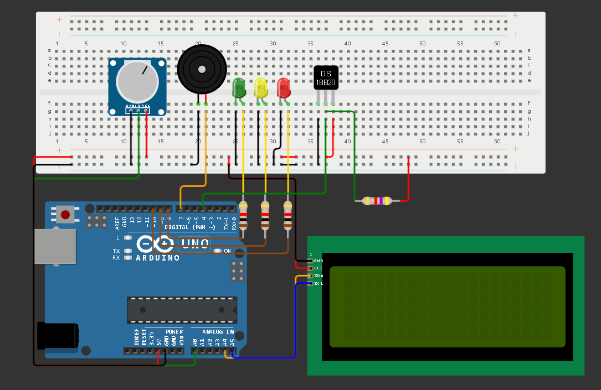

# Projeto Blue Reckon 
## Índice

1. [Sobre](#sobre)
   - [Nosso Projeto](#nosso-projeto)
   - [Nossa Proposta](#nosso-projeto)
   - [Nosso Objetivo](#nosso-objetivo)
2. [Simulação Wokwi](#simulação-wokwi)
3. [Técnologias](#técnologias)
   - [Importante](#importante)
4. [Disclaimer](#disclaimer)
5. [Explicação do Código](#explicação-do-código)
   - [Install](#install)
   - [Imports](#imports)
6. [Funções](#funções)
   - [force_num](#force_num)
   - [force_yes_no](#force_yes_no)
   - [media_template](#media_template)
   - [verifica_leitura](#verifica_leitura)
   - [exibe_leituras](#exibe_leituras)
   - [read_serial](#read_serial)
   - [simula_payload](#simula_payload)
   - [verifica_arduino](#verifica_arduino)
7. [Execução](#execução)
   - [Declarações Globais](#declarações-globais)
   - [Verificação Arduino](#verificação-arduino)
8. [Principal](#principal)
8. [Colaboradores do Projeto](#colaboradores-do-projeto)

## Sobre

### Nosso Projeto
Monitoramento de Temperatura e PH com Arduino foi construído utilizando um sensor DS18B20 e um sensor de PH. Os dados são processados e armazenados em arrays, transmitidos em formato JSON via comunicação serial para um aplicativo Python. LEDs e buzzer são usados para indicar o estado das leituras.

### Nossa Proposta
Pretendemos com essa plataforma, informar sobre os riscos de não cuidar do nosso bem precioso, o oceano, monitorá-lo e sugerir soluções, como o armazenamento de dados históricos para identificar padrões e prever futuras condições, ajudando a prevenir superaquecimento e danos, pois transformam dados brutos em informações acionáveis, melhorando a tomadas de decisões.

### Nosso Objetivo
Queremos mudar o mindset das novas gerações, para que estas possam mudar o mundo: esse é o propósito do nosso projeto que tem como missão informar e alertar sobre os perigos de negligenciar o Oceano. Cuidar deste é o nosso dever como ser humano. O nosso projeto consiste em uma plataforma de informações com artigos, informações e um dashboard de monitoramento, no qual será demonstrado medições feitas através de sensores, informando em tempo real dados sobre o Ph da água e  a temperatura. 

## Simulação Wokwi
[Simulação](https://wokwi.com/projects/399438925654312961)
<a href="https://wokwi.com/projects/399438925654312961" target="_blank" style="text-decoration: none"></a>

## Técnologias
<a href="https://www.python.org/downloads/" target="_blank" style="margin-right:10px"></a>

### **_IMPORTANTE_**
Este código exige o uso de Python 3.10+

## Disclaimer
Devido à natureza do simulador Wokwi, não foi possível conectar o Script ao monitor Serial.

Pensando nisso, incluímos adaptações ao código para permitir que usuários com a mesma limitação possam desfrutar da solução, dando ao usuário a opção de continuar com a execução mesmo sem o Arduino.

Além disso, como o Arduino não inicia caso o código esteja previamente rodando, incluimos uma condição que impede a execução do código caso o usuário decida conectar o Arduino de última hora. 


## Explicação do Código
### Install
Extensão Python Serial Port para Win32, OSX, Linux, BSD, Jython, IronPython ([DOCS](https://pypi.org/project/pyserial/))
```
pip install pyserial
```

### Imports
serial -> Pyserial ([DOCS](https://pypi.org/project/pyserial/))

json -> Nativa Python ([DOCS](https://docs.python.org/pt-br/3/library/json.html))

random -> Nativa Python ([DOCS](https://docs.python.org/pt-br/3/library/random.html))
```
import serial
import json
import random
```

## Funções
### force_num
```
def force_num(msg:str) -> int:
    '''Força que o input do usuário seja um numeral'''
    resp = input(msg)
    while not resp.isnumeric():
        print("Resposta inválida")
        resp = input(msg)
    return int(resp)
```
### force_yes_no
```
def force_yes_no(msg:str) -> int:
    '''Força que o input do usuário seja 1 -> Sim ou 2 -> Não'''
    print(msg)
    resp = input("1 -> Sim | 2 -> Não: ")
    while not resp.isnumeric() and resp != '1' and resp != '2':
        print("Resposta inválida")
        resp = input("1 -> Sim | 2 -> Não: ")
    return int(resp)
```
### media_template
```
def media_template(lista:list) -> float:
    '''
    Permite calcular médias de listas de forma genérica.
    Retorna o resultado como float com 2 casas decimais
    '''
    total=0
    for elemento in lista:
        total+=elemento    
    return float("{:.2f}".format(total/len(lista)))
```
### verifica_leitura
```
def verifica_leitura(payload:dict) -> None:
    '''Verifica os campos de "média" da leitura e exibe uma mensagem condizente com os dados lidos'''
    media_temp = payload['mediaTemp']
    media_ph = payload['mediapH']
    text = ""
    
    if media_temp < 18:
        text += f"A temperatura está abaixo do normal - {media_temp}°C\n"
    elif media_temp > 28:
        text += f"A temperatura está abaixo do normal - {media_temp}°C\n"
    else:
        text += f"A temperatura está dentro do parâmetro esperado - {media_temp}°C\n"
    
    if media_ph < 7.4:
        text += f"O pH está abaixo do normal - {media_ph} - teor ácido"   
    elif media_ph > 8.5:
        text += f"O pH está acima do normal - {media_ph} - teor alcalino"
    else:
        text += f"O pH está dentro do parâmetro esperado - {media_ph}"
    
    # Exibição do texto com formatação para melhor leitura do usuário
    print("="*60)
    print(text)
    print("="*60+"\n")
```
### exibe_leituras
```
def exibe_leituras(payload:dict) -> None:
    '''Lê o payload enviado pelo Arduino e formata-o para ser lido, pensando na melhor experiência do usuário'''
    for campo in payload:
        print("="*25)
        # Separa as exibições de média das demais, uma vez que são apenas um valor, e não uma lista de dados
        if 'media' in campo:
            print(f"{campo}: {payload[campo]}") 
        else:
            print(f"Dados: {campo}")
            for leitura in range(len(payload[campo])):
                print(f"{leitura+1}° leitura: {payload[campo][leitura]}")
                
    print("="*25+"\n")   
```
### read_serial
```
def read_serial() -> dict:
    '''Lê o monitor Serial do Arduino, e converte o json impresso como dicionário'''
    ser = serial.Serial(serial_port, baud_rate)
    while True:
        if ser.in_waiting > 0:
            json_data = ser.readline().decode('utf-8').strip()
            if json_data:
                ser.close()
                return json.loads(json_data)
```
### simula_payload
```
def simula_payload() -> dict:
    '''Simula uma leitura de payload do Arduino enviada pelo monitor Serial'''
    # Leituras de temperatura e pH
    temperaturas = [float("{:.2f}".format(random.uniform(2, 30))) for _ in range(10)]
    ph = [float("{:.2f}".format(random.uniform(0, 14))) for _ in range(10)]

    #Calculo das médias
    media_temp = media_template(temperaturas)
    media_ph = media_template(temperaturas)

    #Json do protótipo
    return {"temperaturas":temperaturas,"pH":ph,"mediaTemp":media_temp,"mediapH":media_ph}
```
### verifica_arduino
```
def verifica_arduino() -> dict:
    '''Verifica se o Arduino está conectado'''
    if arduino:
        return read_serial()
    return simula_payload()
```

## Execução
### Declarações globais
```
# Configurações do Arduino
# ALTERAR CONFORME SUA NECESSIDADE
serial_port = 'COM1'
baud_rate = 9600

# Configuração de execução
arduino = True # Pressupõe que o usuário está com o Arduino conectado
run = True # Força execução do programa
```

### Verificação Arduino
```
conn = force_yes_no("O Arduino está conectado?")
if conn == 2:
    arduino = False
    conn = force_yes_no("Você deseja conecta-lo?\nLembrando que uma vez iniciado, não será possível conecta-lo mais.") # Em caso negativo, pressupõe-se que o usuário quer apenas simular o funcionamento do Arduino
    if conn == 1: 
        print("Beleza!!!")
        print("Como o Arduino precisa estar previamente conectado para funcionar, vamos encerrar o programa por aqui!")
        run = False
```

## Principal

### Execução Completa
```
# Configurações do Arduino
# ALTERAR CONFORME SUA NECESSIDADE
serial_port = 'COM1'
baud_rate = 9600

# Configuração de execução
arduino = True # Pressupõe que o usuário está com o Arduino conectado
run = True # Força execução do programa

if run:
    payload = verifica_arduino()
    while run:
        print("="*30)
        print("Bem vindo ao Blue Reckon!!!")
        print("="*30)
        
        print("Escolha uma opção!")
        print("1 - Gerar uma leitura")
        print("2 - Verificar status do sistema")
        print("3 - Exibir a última leitura do sistema")
        print("4 - Encerrar programa")
        opcao = force_num("\nOpções -> (1|2|3|4): ")
        
        match opcao:
            case 1:
                payload = verifica_arduino()
            case 2:
                verifica_leitura(payload)
            case 3:
                exibe_leituras(payload)
            case 4:
                # Confirmação do encerramento
                confirma = force_yes_no('Tem certeza que quer sair?')
                if confirma == 1:
                    print("Encerrando programa")
                    run = False
                else:
                    print("Cancelando encerramento")

print("Obrigado e até logo!!!")
```

### Apresentação
```
print("="*30)
print("Bem vindo ao Blue Reckon!!!")
print("="*30)
```
### Menu
```
print("Escolha uma opção!")
print("1 - Gerar uma leitura")
print("2 - Verificar status do sistema")
print("3 - Exibir a última leitura do sistema")
print("4 - Encerrar programa")
opcao = force_num("\nOpções -> (1|2|3|4): ")
```
### Execução da Seleção
```
match opcao:
            case 1:
                payload = verifica_arduino()
            case 2:
                verifica_leitura(payload)
            case 3:
                exibe_leituras(payload)
            case 4:
                # Confirmação do encerramento
                confirma = force_yes_no('Tem certeza que quer sair?')
                if confirma == 1:
                    print("Encerrando programa")
                    run = False
                else:
                    print("Cancelando encerramento")
```
### Confimarção de Encerramento
```
# Confirmação do encerramento
confirma = force_yes_no('Tem certeza que quer sair?')
if confirma == 1:
    print("Encerrando programa")
    run = False
else:
    print("Cancelando encerramento")
```

## Colaboradores do Projeto
<div>
<a href="https://github.com/desenise" target="_blank" style="text-align: center; margin-right: 10px;">

<p style="font-size:min(2vh, 36px); margin-top: 10px;">Denise Senise - RM 556006</p>
</a>
<a href="https://github.com/dav0fc" target="_blank" style="text-align: center; margin-right: 10px;">

<p style="font-size:min(2vh, 36px); margin-top: 10px;">	David Gabriel Gomes Fernandes - RM 556020</p>
</a>
<a href="https://github.com/MateusLem" target="_blank" style="text-align: center; margin-right: 10px;">

<p style="font-size:min(2vh, 36px); margin-top: 10px;">Mateus da Costa Leme - RM 557803</p>
</a>
</div>
